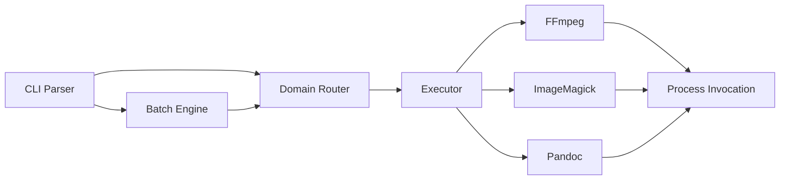

# MCVT (Multi-format ConVerTer)

MCVT is a CLI tool for converting media and documents through one simple interface.

Instead of remembering different command styles for FFmpeg, ImageMagick, and Pandoc, you give MCVT an input and an output, and it figures out the right backend for the job.

---

## Demo


---

## Why MCVT?

Different tools solve different problems, but their command lines are inconsistent and notoriously bloated.

For example, if you want a video that won't crash hardware decoders (even-pixel dimensions), a high-quality dithered GIF, or a PDF that doesn't consume gigabytes of memory, you usually have to Google and type out something like this:

```bash
ffmpeg -i input.avi -c:v libx264 -preset medium -crf 16 -pix_fmt yuv420p -vf "bwdif=deint=interlaced,scale=trunc(iw/2)*2:trunc(ih/2)*2" -movflags +faststart output.mp4
ffmpeg -i input.mp4 -filter_complex "[0:v] fps=15,scale=w=640:h=-1,split [a][b];[a] palettegen [p];[b][p] paletteuse" output.gif
magick input.jpg -resize "1200x1200>" -quality 100 output.pdf
```

With MCVT, those optimization templates are built-in. The exact same jobs are just:

```bash
mcvt input.avi output.mp4
mcvt input.mp4 output.gif
mcvt input.jpg output.pdf
```

That is the main idea: fewer flags, zero Googling, same backend tools.

---
## Features

* One command for video, image, and document conversion
* Automatic backend selection based on file type
* Magic-byte detection, so file extensions are not the only signal
* Batch conversion for directories
* Recursive folder handling
* Basic process cleanup on interrupt so leftover backend processes do not keep running
* Raw backend flag injection when you need full control

---

## Requirements

MCVT does not replace FFmpeg, ImageMagick, or Pandoc. It wraps them.

Install these and make sure they are available in your `PATH`:

* **FFmpeg** for video and audio
* **ImageMagick** (`magick`) for images and PDF rasterization
* **Pandoc** for documents

For PDF output through Pandoc, you also need a local LaTeX engine such as `pdflatex` or `xelatex`.

---

## Installation

### Prebuilt binaries

Download the latest release from GitHub Releases and place the binary somewhere in your `PATH`.

* Windows: `mcvt.exe`
* Linux/macOS: `mcvt`

On Linux/macOS, make it executable:

```bash
chmod +x mcvt
```

### Build from source

```bash
git clone https://github.com/arshalaromal/mcvt.git
cd mcvt
cargo build --release
```

The binary will be in:

* `target/release/mcvt` on Linux/macOS
* `target/release/mcvt.exe` on Windows

---

## Usage

### Single file

```bash
mcvt source.mp4 final.mkv
mcvt image.png image.jpg
mcvt document.docx document.pdf
```

### Folder batch conversion

When the input is a directory, MCVT can process files in bulk.

```bash
mcvt ./raw_footage/ ./encoded_footage/ --batch-ext mkv
mcvt ./assets/ ./processed/ --batch-ext jpg --batch-in png -R
```

### Overrides

Use backend-specific flags when the default behavior is not enough.

```bash
# Trust the extension instead of probing the file
mcvt corrupted.jpg restored.png --no-guess

# Force a conversion path
mcvt animation.mp4 frames.pdf --force video:document

# Pass raw FFmpeg arguments through
mcvt input.mp4 output.mkv --ffmpeg-out -b:v 1M -vf scale=1280:720

# Limit threads during batch jobs
mcvt ./in/ ./out/ --batch-ext mkv --ffmpeg-out -threads 1
```

Run this for the full option list:

```bash
mcvt --help
```

---


## Documentation

More details are in `docs/`:

* [User Guide](docs/USER_GUIDE.md)
* [Developer & Architecture Guide](docs/ARCHITECTURE.md)

---

## Architecture



### Implementation notes

* `router.rs` reads file headers and maps input files to a conversion domain.
* `batch.rs` handles directory traversal and output path mapping.
* `executor.rs` starts backend processes and manages dependency checks.
* `main.rs` handles interrupt cleanup and process termination.

---

## Roadmap

### Done

- [x] Unified routing for multiple file types
- [x] Magic-byte detection
- [x] Batch conversion
- [x] Recursive directory mapping
- [x] Interrupt cleanup for backend processes
- [x] Path safety checks

### Planned

- [ ] A single shared runner abstraction for all backends
- [ ] Better startup caching for dependency checks
- [ ] `--skip-existing` for batch mode
- [ ] External config for conversion templates
- [ ] Progress parsing for single-file conversions

