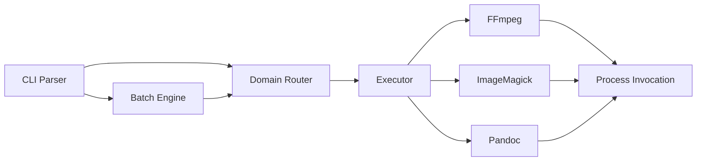

# MCVT (Multi-format ConVerTer)

MCVT is a unified, thread-safe command-line routing engine for media and document conversions. It abstracts the distinct syntaxes of FFmpeg, ImageMagick, and Pandoc behind a single standardized interface.

Built in Rust, MCVT features magic-byte file detection, concurrent directory batching, recursive folder mapping, and strict process lifecycle management to prevent system resource starvation.

---

## 📚 Documentation

Detailed documentation is available in the `docs/` directory:
* **[User Guide](docs/USER_GUIDE.md):** Comprehensive manual covering all commands, batch processing overrides, and namespaced argument injections.
* **[Developer & Architecture Guide](docs/ARCHITECTURE.md):** Deep dive into the routing logic, thread-pool caching, technical debt, and system architecture.

---

## Features

* **Unified Routing:** Automatically identifies domains (Video/Audio, Image, Document) and invokes the correct backend binary.
* **Magic Byte Detection:** Bypasses spoofed or missing file extensions by reading binary headers.
* **Parallel Batch Processing:** Utilizes a concurrent worker pool to process massive directory trees, scaling to available CPU cores.
* **Recursive Directory Mirroring:** Scans deeply nested folder hierarchies and replicates the exact structure in the output destination.
* **Zombie Process Assassination:** Intercepts system interrupts (`Ctrl+C`) to trace and terminate orphaned background processes (e.g., FFmpeg threads).
* **Targeted Argument Injection:** Allows users to bypass default optimization templates by injecting raw flags directly into backend processors.

---

## Prerequisites

MCVT is a routing and execution layer. It requires the following backend binaries to be installed and accessible within your system `PATH`:

* **FFmpeg:** For Video and Audio domains.
* **ImageMagick (`magick`):** For Image domains and PDF rasterization.
* **Pandoc:** For Document domains. *(Note: PDF generation via Pandoc requires a local LaTeX engine like `pdflatex` or `xelatex`).*

---

## Installation

MCVT can be installed via pre-compiled standalone binaries or built directly from the Rust source code.

### Option 1: Pre-compiled Binaries (Recommended)

Download the latest executable for your operating system from the **[GitHub Releases](https://github.com/arshalaromal/mcvt/releases)** page.

1. Download the binary matching your OS (`mcvt.exe` for Windows, `mcvt` for Linux/macOS).
2. Place the file in a directory that is included in your system's `PATH` (e.g., `C:\Program Files\MCVT\` or `/usr/local/bin/`).
3. *(Linux/macOS only)*: Mark the binary as executable by running `chmod +x mcvt`.

> **⚠️ OS Support Warning:** MCVT is primarily developed and heavily tested on Windows. Linux and macOS binaries are provided as a convenience via automated cross-compilation pipelines.

### Option 2: Build from Source

If you prefer to compile the engine locally or are running a non-standard architecture, ensure you have the [Rust toolchain](https://rustup.rs/) installed.

```bash
git clone https://github.com/yourusername/mcvt.git
cd mcvt
cargo build --release

```

The optimized binary will be generated at `target/release/mcvt` (or `mcvt.exe` on Windows). Move this file to your system `PATH` to execute the engine globally.

---

## Usage Guide (Users)

> **📖 Read the full [User Guide](docs/USER_GUIDE.md) for advanced operations.**

### Standard Operations (Single File)

MCVT requires exactly two positional arguments: input and output. It automatically handles the routing and applies optimized default templates.

```bash
mcvt source.mp4 final.mkv
mcvt graphic.png compressed.jpg
mcvt essay.docx essay.pdf

```

### Batch Operations (Directory Processing)

Passing a directory as the input automatically engages Batch Mode.

```bash
# Convert an entire folder to .mkv
mcvt ./raw_footage/ ./encoded_footage/ --batch-ext mkv

# Convert only .png files to .jpg recursively (-R)
mcvt ./assets/ ./processed/ --batch-ext jpg --batch-in png -R

```

### Overrides & Injection

Bypass MCVT's automation when necessary using targeted flags.

```bash
# Disable Magic Bytes (trust the file extension)
mcvt corrupted.jpg restored.png --no-guess

# Force a specific conversion pathway
mcvt animation.mp4 frames.pdf --force video:document

# Inject raw arguments directly into FFmpeg (bypass templates)
mcvt input.mp4 output.mkv --ffmpeg-out -b:v 1M -vf scale=1280:720

# Restrict CPU threads during a batch job to prevent OS lockup
mcvt ./in/ ./out/ --batch-ext mkv --ffmpeg-out -threads 1

```

Use `mcvt --help` for the complete list of flags and options.

---

## Architecture (Developers)

> **⚙️ Read the full [Developer & Architecture Guide](docs/ARCHITECTURE.md) for data flow and internal mechanics.**



MCVT is designed to handle unsafe external C-binaries safely within a multithreaded Rust environment.

* **`router.rs`:** Utilizes the `file_format` crate to read binary headers. Maps inputs to a logical `Domain` (VideoAudio, Image, Document) to prevent routing failures on malformed extensions.
* **`batch.rs`:** Pre-calculates all relative path structures and creates output directories single-threadedly. It then passes lightweight `(&Cli, &str, &str)` references to the `rayon::par_iter()` pool, ensuring threads spend zero CPU cycles on path manipulation.
* **`executor.rs`:** Prevents OS scheduler Denial-of-Service (DOS) during batch runs via a `OnceLock<RwLock<HashSet<String>>>`. Threads check binary dependencies (e.g., `ffmpeg --version`) exactly once; subsequent checks return $O(1)$ from the heap.
* **`main.rs` (Process Management):** Implements a global `ctrlc` tripwire using the `sysinfo` crate. Interrupts scan the OS process tree, identify `parent() == Some(MCVT_PID)`, and execute hard kills on orphaned background C-binaries.

---

## Project Roadmap

### Completed Core Features

* [x] Unified inter-domain routing logic
* [x] Magic Byte binary header detection
* [x] Thread-safe Rayon batch processor
* [x] Recursive directory mapping (`WalkDir`)
* [x] Global Ctrl+C Zombie Process Assassin
* [x] Canonical path self-overwrite protection
* [x] Zero-allocation `Cli` references in batch loops
* [x] RwLock Dependency Cache

### Technical Debt & Future Features

* [ ] **Runner Struct Refactoring:** Consolidate `FfmpegRunner`, `ImageMagickRunner`, and `PandocRunner` into a single generic struct implementing a `ToolRunner` Trait (DRY principle).
* [ ] **Cache Stampede Fix:** Implement an atomic state machine (`Pending`, `Verified`) inside the `RwLock` to prevent the initial $N$-thread race condition on startup.
* [ ] **Batch Collision Handling:** Add a `--skip-existing` flag to prevent hardcoded `-y` binary overwrites in batch mode.
* [ ] **Externalized Templates:** Move hardcoded optimization chains (e.g., CRF values, scaling logic) out of `templates.rs` and into a deserialized `~/.config/mcvt/templates.toml` file.
* [ ] **Single-File Progress Parsing:** Hook into `stdout` streams of underlying binaries to provide accurate percentage-based progress bars for single-file operations.

```
